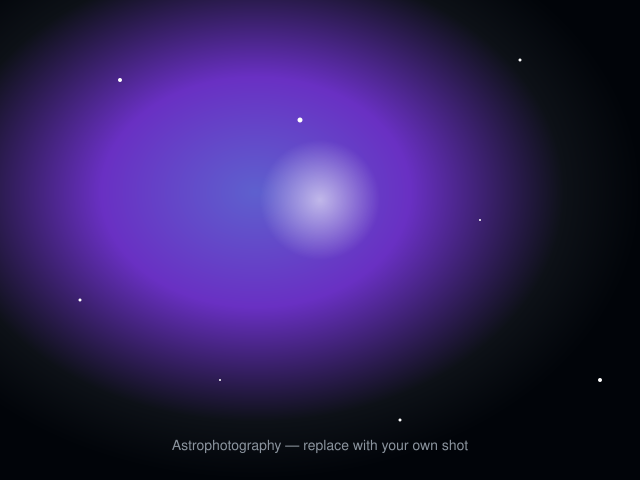
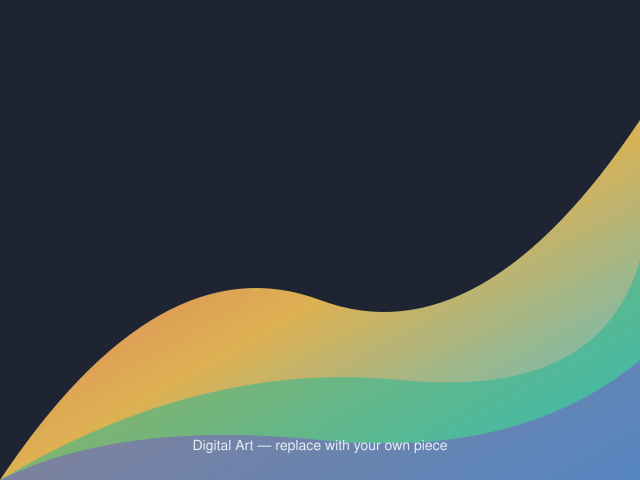

<!-- Profile README for @deresolution20 -- generated by GitHub Repo Redesign skill -->

<!-- Creative splash: gradient banner with three brand pillars -->

# Brice

### Observability Support Engineer   ·  Astrophotographer & Digital Artist

Creative outlet: **Astrophotographer & Digital Artist**

---

## By the Numbers

| Metric | Value |
|--------|-------|
| Focus | Quality over quantity — curated showcase repos |
| Top Languages | Python, Go, javascript, HCL |

## Pinned Showcase

Hand-picked repositories that represent my best professional work:

### [mlx-mcp-server](https://github.com/deresolution20/mlx-mcp-server)
> MCP server bridging Claude to local MLX LM (and any OpenAI-compatible backend)

`Python`  |  CI: yes  |  Tests: yes  |  MIT License

## What I Build

| Pillar | What it means |
|--------|--------------|
| **Observability** | Grafana, Prometheus, Loki, Tempo — production monitoring & SLOs |
| **Creative Code** | Astrophotography processing, digital art with Procreate and iPad |

## GitHub Stats

## Creative Splash

<!-- Replace assets/astro-placeholder.svg and assets/art-placeholder.svg with real photos (keep filenames or update paths). -->

### Where Engineering Meets Art

When I'm not debugging pipelines or automating workflows, I'm capturing the cosmos.

<table>
  <tr>
    <td width="50%" align="center"> Astrophotography — deep sky imaging</td>
    <td width="50%" align="center"> Digital painting — generative art</td>
  </tr>
</table>

## Let's Connect

| Platform | Link |
|----------|------|
| GitHub | [github.com/deresolution20](https://github.com/deresolution20) |
| Upwork | [Hire me for AI Automation](https://www.upwork.com/) |
| Grafana Labs | [grafanalabs.com](https://grafana.com/) |

---

This profile was built with the **GitHub Repo Redesign** skill — 
audit, classify, clean, and brand your GitHub like a top 0.1% engineer.

Last updated: 2026-06-17

